# Architecture

> Back to [README](README.md)

```mermaid
graph TB
    TL["🏰 Team Lead<br/><sub>Claude Opus 4.6</sub><br/><sub>Analyze → Decompose → Delegate → Verify</sub>"]

    subgraph Standard["Standard Tier"]
        DEV[Developer]
        UI[UI/UX Expert]
        CE[Content Engineer]
        DB[Database Engineer]
        PERF[Perf Expert]
        API[API Designer]
    end

    subgraph Premium["Premium Tier"]
        SEC[Security Expert]
        ARCH[Architect]
    end

    subgraph Utility["Utility Tier"]
        TEST[Testing Expert]
        DATA[Data Expert]
        DEVOPS[DevOps Expert]
        RM[Release Manager]
    end

    subgraph Economy["Economy Tier"]
        DOCS[Docs Writer]
        RES[Researcher]
        REV[Reviewer]
        COPY[Copywriter]
        SEO[SEO Specialist]
    end

    TL --> Standard
    TL --> Premium
    TL --> Utility
    TL --> Economy

    KB["📚 Instructions · Skills · Workflows · Prompts"]
    TL -.-> KB
```

## Model Tiers

| Tier | Model | Use case |
|------|-------|----------|
| Premium | Claude Opus 4.6 | Architecture, security, orchestration |
| Standard | Gemini 3.1 Pro | Features, schemas, UI |
| Utility | GPT-5.3-Codex | Testing, data, deployment |
| Economy | GPT-5 mini | Documentation |

---

## Workflow Templates

| Template | Flow |
|----------|------|
| `feature-implementation` | DB → Query → UI → Tests |
| `bug-fix` | Triage → RCA → Fix → Verify |
| `data-pipeline` | Scrape → Convert → Enrich → Import |
| `security-audit` | Scope → Automate → Review → Remediate |
| `performance-optimization` | Measure → Analyze → Optimize → Verify |
| `schema-changes` | CMS model modifications and queries |
| `database-migration` | Migrations, access policies, rollback |
| `refactoring` | Safe refactoring with behavior preservation |

---

## Quality Gates

| Gate | Method |
|------|--------|
| **Deterministic** | Lint, type-check, unit tests, build verification |
| **Fast review** | Mandatory single-reviewer sub-agent after every delegation, with automatic retry and escalation |
| **Panel review** | 3 isolated reviewer sub-agents, 2/3 majority wins (high-stakes or escalation) |
| **Structured disputes** | Formal dispute records when automated resolution is exhausted — packages both perspectives and resolution options for human decision |
| **Browser testing** | Chrome DevTools MCP at 3 responsive breakpoints |
| **Self-review** | Every agent asked *"What edge cases am I missing?"* |
