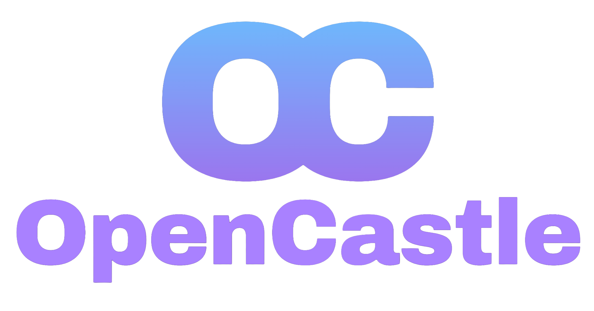
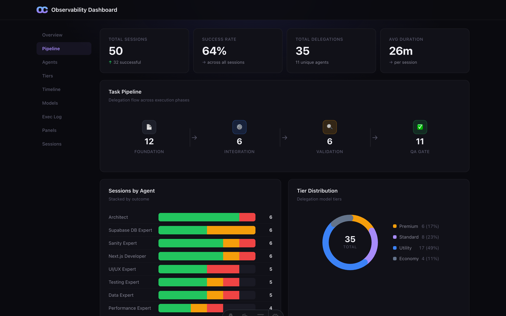

# OpenCastle

<p align="center">
  
</p>

<p align="center">
  <strong>Turn your AI coding assistant into a multi-agent team.</strong>
</p>

<p align="center">
  <a href="https://github.com/etylsarin/opencastle/stargazers"></a>
  <a href="https://www.npmjs.com/package/opencastle"></a>
  <a href="https://github.com/etylsarin/opencastle/actions/workflows/ci.yml"></a>
  <a href="LICENSE"></a>
  <a href="https://www.npmjs.com/package/opencastle"></a>
</p>

<p align="center">
  <a href="https://www.opencastle.dev/">Website</a> &middot;
  <a href="https://www.opencastle.dev/docs/">Docs</a> &middot;
  <a href="#quick-start">Quick Start</a> &middot;
  <a href="ARCHITECTURE.md">Architecture</a> &middot;
  <a href="#contributing">Contributing</a>
</p>

---

Works with **[GitHub Copilot](https://github.com/features/copilot)**, **[Cursor](https://www.cursor.com/)**, **[Claude Code](https://docs.anthropic.com/en/docs/agents-and-tools/claude-code/overview)**, and **[OpenCode](https://opencode.ai/)**.

One command sets up specialized agents that decompose tasks, work in parallel, and verify each other's output.

One command. Any repo. Any IDE.

<br>

## Quick Start

```bash
npx opencastle init
```

The CLI asks about your IDEs and stack. It installs agents, skills, and MCP servers tailored to your project.

You can select multiple IDEs and tools — the output is adapted for each one.

<br>

### What gets generated

| IDE | Output |
|-----|--------|
| **VS Code** | `.github/` — agents, skills, workflows, prompts |
| **Cursor** | `.cursorrules` + `.cursor/rules/` |
| **Claude Code** | `CLAUDE.md` + `.claude/` |
| **OpenCode** | `AGENTS.md` + `.opencode/` + `opencode.json` |

MCP servers are auto-configured for your stack in each IDE's native format.

<br>

### CLI

| Command | Description |
|---------|-------------|
| `opencastle init` | Set up agents in your project |
| `opencastle update` | Update framework files (keeps your customizations) |
| `opencastle eject` | Remove the dependency, keep all files |
| `opencastle run` | Run a [task queue](#task-queue) autonomously |
| `opencastle dashboard` | Open the observability dashboard |
| `opencastle doctor` | Validate your setup and surface issues |

Add `--dry-run` to any command to preview what it would change without writing files.

📖 [Full CLI documentation →](https://www.opencastle.dev/docs/cli)

<br>

## What's Inside

**Specialist Agents.** Developer, UI/UX, Database, Security, Testing, Reviewer, and more.

**On-Demand Skills.** Loaded on demand to keep context windows lean. Auto-selected during init based on your stack.

**Workflow Templates.** Features, bug fixes, data pipelines, security audits — reproducible execution templates.

**Quality gates.** Fast review after every step. Panel majority vote for high-stakes changes. Lint, test, build checks.

**Cost-aware routing.** Picks the right model tier (Premium → Economy) based on task complexity.

**Self-improving.** Agents capture lessons and graduate them into permanent instructions.

<br>

## Dashboard

```bash
npx opencastle dashboard
```

<p align="center">
  
</p>

Visualizes real agent data from your project — sessions, success rates, model usage, execution logs, and panel reviews.

Reads from the same NDJSON logs your agents already write. No setup needed.

📖 [Dashboard CLI documentation →](https://www.opencastle.dev/docs/cli#dashboard)

<br>

## Doctor

```bash
npx opencastle doctor
```

Runs multiple health checks — manifest, configs, skills, observability logs, IDE settings, MCP setup, and environment variables. Useful in CI or after upgrading.

📖 [Doctor CLI documentation →](https://www.opencastle.dev/docs/cli#doctor)

<br>

## Task Queue

Queue tasks in YAML. Let agents run overnight. Dependencies resolve automatically.

```bash
npx opencastle run
```

```yaml
name: "Overnight feature batch"
concurrency: 2
adapter: claude-code

tasks:
  - id: migrate-db
    agent: database-engineer
    prompt: "Create a reviews table migration."
    timeout: 10m

  - id: build-component
    agent: ui-ux-expert
    prompt: "Build a ReviewCard component."
    timeout: 15m

  - id: wire-page
    agent: developer
    prompt: "Add reviews to the place detail page."
    depends_on: [migrate-db, build-component]
```

TIP: Use the **"Generate Task Spec"** prompt to create this file from a plain description. No YAML by hand.

📖 [Task queue CLI documentation →](https://www.opencastle.dev/docs/cli#task-queue)

<br>

## Architecture

See **[ARCHITECTURE.md](ARCHITECTURE.md)** for the full diagram, workflow templates, and quality gates.

<br>

## Contributing

1. Fork the repo
2. Create a branch — `feat/your-feature` or `fix/your-fix`
3. Make changes and ensure `npm run build:cli` passes
4. Open a PR

For large changes, [open an issue](https://github.com/etylsarin/opencastle/issues) first.

<br>

## Support

OpenCastle is free and open-source.

<p align="center">
  <a href="https://ko-fi.com/A0A61V4992" target="_blank"></a>
</p>

For corporate sponsorship inquiries, open a [GitHub Discussion](https://github.com/etylsarin/opencastle/discussions).

<br>

## License

[MIT](LICENSE) — Filip Mares, 2026
