# OpenCastle

<p align="center">
  
</p>

<p align="center">
  <strong>Open-source multi-agent orchestration framework for AI coding assistants</strong>
</p>

<p align="center">
  <a href="https://www.opencastle.dev/">Website</a> &middot;
  <a href="#quick-start">Quick Start</a> &middot;
  <a href="#architecture">Architecture</a> &middot;
  <a href="LICENSE">MIT License</a>
</p>

---

OpenCastle turns **GitHub Copilot**, **Cursor**, and **Claude Code** into coordinated multi-agent teams. Instead of one AI doing everything, it decomposes complex tasks across specialized agents that work in parallel — each with its own domain expertise, tools, and file partition.

One command. Any repo. Any IDE.

## Quick Start

```bash
npx opencastle init
```

Choose your IDE and the CLI generates the right format:

| IDE | Output |
|-----|--------|
| **VS Code** (Copilot) | `.github/` — agents, instructions, skills, workflows, prompts |
| **Cursor** | `.cursorrules` + `.cursor/rules/**/*.mdc` |
| **Claude Code** | `CLAUDE.md` + `.claude/` — agents, skills, commands |

All targets include a pre-configured **MCP server config** for Sanity, Vercel, Supabase, Linear, and Chrome DevTools.

### Getting started

1. Run the **"Bootstrap Customizations"** prompt to configure for your project
2. Customize agent definitions and skills for your tech stack
3. Set the Team Lead as your Copilot Chat mode and start delegating
4. Commit the generated files to your repository

### CLI commands

| Command | Description |
|---------|-------------|
| `npx opencastle init` | Set up OpenCastle in your project |
| `npx opencastle update` | Update framework files (preserves customizations) |
| `npx opencastle diff` | Preview what an update would change |
| `npx opencastle eject` | Remove dependency, keep all files standalone |
| `npx opencastle run` | Process a task queue autonomously ([details](#task-queue)) |
| `npx opencastle dashboard` | View agent observability dashboard |

### Project structure (VS Code)

```
.github/
├── agents/              # 18 specialist agent definitions
├── instructions/        # Always-loaded project context
├── skills/              # 28 on-demand knowledge modules
├── agent-workflows/     # 8 reproducible execution templates
├── prompts/             # 9 reusable prompt templates
└── customizations/      # Your project config (never overwritten)
.vscode/
└── mcp.json             # MCP server config
```

---

## Key Features

| Feature | What it does |
|---------|-------------|
| **Team Lead orchestrator** | Analyzes, decomposes, delegates, and verifies work across agents |
| **18 specialist agents** | Developer, UI/UX, Database, Security, Testing, Reviewer, and more |
| **28 on-demand skills** | Loaded per task to keep context windows lean |
| **8 workflow templates** | Features, bug fixes, data pipelines, security audits, etc. |
| **Multi-IDE support** | VS Code, Cursor, Claude Code — native formats for each |
| **Autonomous mode** | Queue tasks in YAML, run overnight without supervision |
| **Quality gates** | Fast review after every step, panel majority vote for high-stakes, structured dispute escalation, lint/test/build checks, browser testing |
| **Cost-aware routing** | Auto-selects model tier (Premium → Economy) by complexity |
| **Self-improvement** | Agents capture lessons and graduate them into instructions |

---

## Dashboard

Track your agent team's performance with a built-in observability dashboard:

```bash
npx opencastle dashboard
```

Opens a local dashboard at `http://localhost:4300` that visualizes your project's real agent data:

- **KPIs** — Total sessions, success rate, delegations, avg duration
- **Pipeline** — Task flow across execution phases
- **Charts** — Sessions by agent, tier distribution, timeline, model usage
- **Execution log** — Recent agent activity step by step
- **Panel reviews** — Quality gate verdicts and fix items
- **Sessions table** — Sortable session history

The dashboard reads NDJSON logs from `.github/customizations/logs/` — the same files your agents write to during normal operation. No configuration needed.

| Flag | Description |
|------|-------------|
| `--port <n>` | Custom port (default: 4300) |
| `--no-open` | Don't auto-open browser |
| `--seed` | Show demo data instead of project logs |

---

## Architecture

```mermaid
graph TB
    TL["🏰 Team Lead<br/><sub>Claude Opus 4.6</sub><br/><sub>Analyze → Decompose → Delegate → Verify</sub>"]

    subgraph Standard["Standard Tier"]
        DEV[Developer]
        UI[UI/UX Expert]
        CE[Content Engineer]
        DB[Database Engineer]
        PERF[Perf Expert]
        API[API Designer]
    end

    subgraph Premium["Premium Tier"]
        SEC[Security Expert]
        ARCH[Architect]
    end

    subgraph Utility["Utility Tier"]
        TEST[Testing Expert]
        DATA[Data Expert]
        DEVOPS[DevOps Expert]
        RM[Release Manager]
    end

    subgraph Economy["Economy Tier"]
        DOCS[Docs Writer]
        RES[Researcher]
        REV[Reviewer]
        COPY[Copywriter]
        SEO[SEO Specialist]
    end

    TL --> Standard
    TL --> Premium
    TL --> Utility
    TL --> Economy

    KB["📚 Instructions · Skills · Workflows · Prompts"]
    TL -.-> KB
```



### Model tiers

| Tier | Model | Use case |
|------|-------|----------|
| Premium | Claude Opus 4.6 | Architecture, security, orchestration |
| Standard | Gemini 3.1 Pro | Features, schemas, UI |
| Utility | GPT-5.3-Codex | Testing, data, deployment |
| Economy | GPT-5 mini | Documentation |

---

## Workflow Templates

| Template | Flow |
|----------|------|
| `feature-implementation` | DB → Query → UI → Tests |
| `bug-fix` | Triage → RCA → Fix → Verify |
| `data-pipeline` | Scrape → Convert → Enrich → Import |
| `security-audit` | Scope → Automate → Review → Remediate |
| `performance-optimization` | Measure → Analyze → Optimize → Verify |
| `schema-changes` | CMS model modifications and queries |
| `database-migration` | Migrations, access policies, rollback |
| `refactoring` | Safe refactoring with behavior preservation |

---

## Task Queue

Queue tasks in a YAML spec file and let agents run overnight — no supervision required. Tasks form a DAG; dependencies resolve automatically.

### Generating the spec

Use the **"Generate Task Spec"** prompt to create a valid `opencastle.tasks.yml` from a high-level description of what you want to accomplish. The prompt guides the Team Lead through goal analysis, task decomposition, dependency graphing, and writing self-contained agent instructions — so you don't have to author the YAML by hand.

```bash
npx opencastle run                         # Uses opencastle.tasks.yml
npx opencastle run -f my-tasks.yml         # Custom spec file
npx opencastle run --dry-run               # Preview execution plan
npx opencastle run --concurrency 3         # Parallel tasks
```

### Spec format

```yaml
name: "Overnight feature batch"
concurrency: 2
on_failure: continue     # "continue" | "stop"
adapter: claude-code

tasks:
  - id: migrate-db
    agent: database-engineer
    prompt: |
      Create a new Supabase migration for a reviews table.
    files: [supabase/migrations/]
    timeout: 10m

  - id: build-component
    agent: ui-ux-expert
    prompt: |
      Build a ReviewCard component following existing patterns.
    files: [libs/shared-ui/src/components/ReviewCard/]
    timeout: 15m

  - id: wire-page
    agent: developer
    prompt: |
      Add a reviews section to the place detail page.
    depends_on: [migrate-db, build-component]
    timeout: 20m
```

### Reference

<details>
<summary>Task fields</summary>

| Field | Required | Default | Description |
|-------|----------|---------|-------------|
| `id` | Yes | — | Unique identifier |
| `prompt` | Yes | — | Instructions for the agent |
| `description` | No | Same as `id` | Human-readable label |
| `agent` | No | `developer` | Specialist agent role |
| `depends_on` | No | `[]` | Task IDs that must complete first |
| `files` | No | `[]` | File/directory scope |
| `timeout` | No | `30m` | Max duration (`30s`, `10m`, `1h`) |

</details>

<details>
<summary>Top-level options</summary>

| Field | Default | Description |
|-------|---------|-------------|
| `name` | *(required)* | Human-readable run name |
| `concurrency` | `1` | Max parallel tasks |
| `on_failure` | `continue` | `continue` skips dependents; `stop` halts all |
| `adapter` | `claude-code` | Agent runtime adapter |

</details>

<details>
<summary>CLI options</summary>

| Flag | Description |
|------|-------------|
| `--file, -f <path>` | Task spec file (default: `opencastle.tasks.yml`) |
| `--dry-run` | Show execution plan without running |
| `--concurrency, -c <n>` | Override max parallel tasks |
| `--adapter, -a <name>` | Override agent runtime |
| `--report-dir <path>` | Report output dir (default: `.opencastle/runs`) |
| `--verbose` | Show full agent output |

</details>

### Adapters

| Adapter | Status | CLI |
|---------|--------|-----|
| `claude-code` | ✅ Supported | `claude` |
| `copilot` | ✅ Supported | `copilot` |
| `cursor` | ✅ Supported | `agent` |

After each run, a JSON report is written to `.opencastle/runs/` with statuses, durations, and output summaries.

---

## Quality Gates

| Gate | Method |
|------|--------|
| **Deterministic** | Lint, type-check, unit tests, build verification |
| **Fast review** | Mandatory single-reviewer sub-agent after every delegation, with automatic retry and escalation |
| **Panel review** | 3 isolated reviewer sub-agents, 2/3 majority wins (high-stakes or escalation) |
| **Structured disputes** | Formal dispute records when automated resolution is exhausted — packages both perspectives and resolution options for human decision |
| **Browser testing** | Chrome DevTools MCP at 3 responsive breakpoints |
| **Self-review** | Every agent asked *"What edge cases am I missing?"* |

---

## Battle-Tested

Forged in a production monorepo shipping real consumer apps — thousands of agent delegations, not theory.

- **92 orchestration files** · ~58K words of curated knowledge
- **8 workflow templates** covering the full SDLC
- **Mandatory fast review** on every step — inspired by [Steroids CLI](https://github.com/UnlikeOtherAI/steroids-cli)'s coder/reviewer separation
- **Structured dispute escalation** — when agents can't resolve after N attempts, formal dispute records replace raw failure logs, giving humans clear action items (also inspired by Steroids CLI)
- **Self-improving** — agents capture lessons and graduate them into permanent instructions

## License

[MIT](LICENSE) — Filip Mares, 2026
