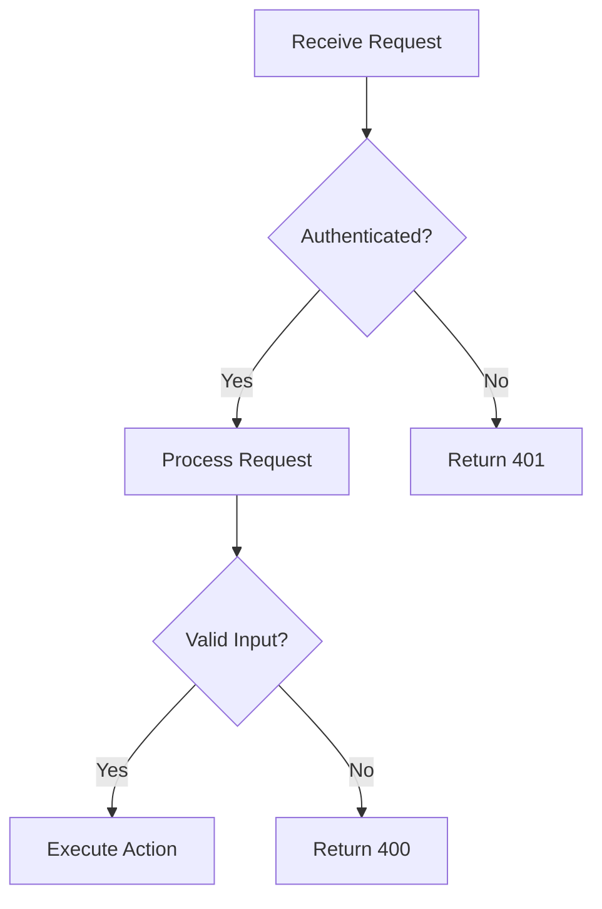
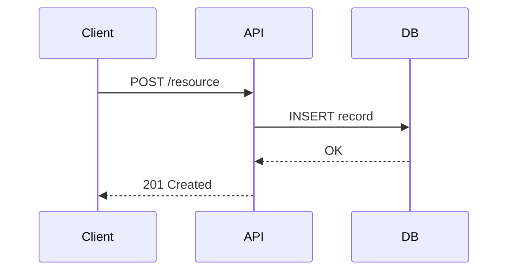

<!-- ⚠️ This file is managed by OpenCastle. Edits will be overwritten on update. Customize in the .opencastle/ directory instead. -->

# Documentation Standards

Generic documentation templates and writing standards. For project-specific directory structure and practices, see [docs-structure.md](../../.opencastle/project/docs-structure.md).

## Issue Documentation Template

```markdown
### ISSUE-ID: Brief Description

**Issue ID:** ISSUE-ID
**Status:** Known Limitation | Fixed | Workaround Available
**Severity:** Critical | High | Medium | Low
**Impact:** [What user/developer experience is affected]

#### Problem
[Clear description of the issue]

#### Root Cause
[Technical explanation]

#### Solution Options
1. **Option A** — [Description]
   - Pros: ...
   - Cons: ...
2. **Option B** — [Description]

#### Related Files
- `path/to/file.ts` — [What it does]
```

## Roadmap Update Template

When a feature is completed:
1. Change status to `COMPLETE` and add completion date
2. List modified files and update the summary table
3. Move to completed section if applicable

## Architecture Decision Record Template

```markdown
## ADR-NNN: Decision Title

**Date:** YYYY-MM-DD
**Status:** Accepted | Superseded | Deprecated
**Context:** [Why this decision was needed]
**Decision:** [What was decided]
**Consequences:** [Impact of the decision]
**Alternatives Considered:** [What else was evaluated]
```

## README Template

Use this structure for library or feature-level READMEs:

```markdown
# Feature / Library Name

One-sentence summary of what this does and why it exists.

## Quick Start

Brief usage example or setup steps.

## Architecture

High-level overview. Include a Mermaid diagram for non-trivial systems.

## Key Files

| File | Purpose |
|------|---------|
| `src/handler.ts` | Request handling logic |
| `src/schema.ts` | Validation schemas |
```

## Mermaid Diagram Patterns

Keep diagrams focused — one concern per diagram.
### Flowchart (decision logic, pipelines)



### Sequence Diagram (API flows, multi-service interactions)



### ER Diagram (data models, relationships)

```mermaid
erDiagram
  USER ||--o{ ORDER : places
  ORDER ||--|{ LINE_ITEM : contains
  USER { string id PK; string email }
  ORDER { string id PK; date created_at }
```

### Diagram Guidelines

- Add a title comment (`%% Title: ...`) at the top of complex diagrams
- Use verb labels on relationship arrows
- Limit nodes to 10–12 per diagram; split larger systems into sub-diagrams
- Prefer `flowchart TD` (top-down) for pipelines and `flowchart LR` (left-right) for request flows

## Changelog Entry Template

Follow Conventional Commits format. Group entries by type under a version heading:

```markdown
## [1.2.0] — YYYY-MM-DD

### Added
- feat: Add retry logic to API client (#123)

### Fixed
- fix: Resolve race condition in queue processor (#127)

### Changed
- refactor: Extract validation into shared module (#125)
```

### Changelog Rules

- One line per change; reference the PR or issue number
- Use imperative mood: "Add", "Fix", "Remove" — not "Added", "Fixed"
- Group under `Added`, `Fixed`, `Changed`, `Removed`, `Deprecated`, `Security`
- Most recent version at the top

## Writing Guidelines

- Write clear, concise prose — avoid jargon unless necessary
- Include Mermaid diagrams for architecture
- Link to related files using relative paths
- Use tables for structured data; include "Last Updated" dates on all documents
- Archive outdated docs rather than deleting; cross-reference between documents

### Formatting Rules

- **Headings**: Use H2 for sections, H3 for subsections. Do not use H1 — generated from title. Avoid H4+
- **Lists**: Use `-` for bullet points and `1.` for numbered lists; indent nested lists with two spaces
- **Code Blocks**: Use fenced code blocks with language specified for syntax highlighting
- **Links**: Use `[link text](URL)` with descriptive text and valid URLs
- **Images**: Use `` with brief descriptive alt text
- **Tables**: Use `|` tables with properly aligned columns and headers
- **Whitespace**: Use blank lines to separate sections; avoid excessive whitespace

### Front Matter

Include YAML front matter at the beginning of instruction/skill files:

- `title` / `name`: The title of the document
- `description`: A brief description of the document content
- `applyTo`: (for instruction files) Glob pattern for which files the instructions apply to

## Documentation Review Checklist

Before merging docs, verify:

- [ ] **Accuracy** — all code snippets, file paths, and commands are correct and tested
- [ ] **Completeness** — no TODO placeholders or empty sections remain
- [ ] **Links** — all internal and external links resolve (no 404s)
- [ ] **Front matter** — YAML front matter is present and valid
- [ ] **Formatting** — consistent heading levels, list style, whitespace, and Mermaid renders
- [ ] **Cross-references** — related docs link to each other; "Last Updated" is current

## Anti-Patterns

| Anti-Pattern | Why It's Bad | Do This Instead |
|-------------|-------------|-----------------|
| Wall of text with no headings | Unnavigable; readers skip it | Break into sections with H2/H3 |
| Duplicating content across files | Copies drift; causes confusion | Link to a single source of truth |
| Screenshots without alt text | Inaccessible; breaks when UI changes | Use Mermaid diagrams or describe the UI |
| Documenting implementation details | Becomes stale as code changes | Document intent and contracts |
| Using absolute file paths | Breaks on other machines | Use relative paths from doc location |
| Huge monolithic README | Low signal-to-noise | Split into focused docs, link from README |
| Undated documents | No way to judge currency | Always include "Last Updated" date |
| Using H1 inside document body | Conflicts with auto-generated title | Start body headings at H2 |
